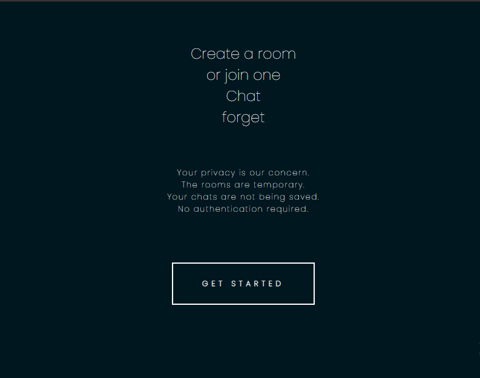
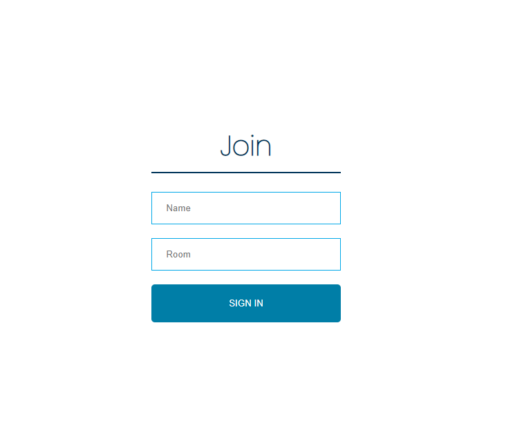

    

Buzz-and-go :sparkles:
============

[**Buzz-and-go**](https://buzz-and-go.herokuapp.com/) is a **real time Web based chat application**. One can create a **temporary chatroom**, invite others in it and chat without restrictions. The room is deleted when all the members are offline. It doesn't require authentication so gives a hassle-free,easy to use, user-friendly chat experience i.e  the end users  **don't identify**  themselves. To respect privacy data is  **not**  stored on any remote server.

    

## Easy to create room and chat!

    

### Info for developers :clipboard:
#### About frontend
This project includes a light weight frontend UI - bootstrapped with  [create-react-app](https://reactjs.org/docs/create-a-new-react-app.html). The FE client is located in  `./client`  folder.  
#### About Backend
The backend runs on express/nodejs. In production mode, express server exposes the API endpoints and serve the static frontend from  `./client/build`.

## How to get started :book:

 -  Fork the repo.
 - Clone the Github repository 
 `git clone https://github.com/iamshubhankarkhare/Chat-application.git`
 - Move to the project folder 
 `cd Chat-application`
 
 - Install the server dependencies `npm install`
 - Move to the client folder `cd client`
 - Install the client dependencies `npm install`
 - Move to the base folder again `cd ..`
 - Run both the client and server `npm run dev`
 
## Direct links for contributing :link:
Thank you so much for your interest in contributing!.
All types of contributions are encouraged and valued.

* [Issues](https://github.com/iamshubhankarkhare/Chat-application/issues)
* [Create new PR](https://github.com/iamshubhankarkhare/Chat-application/pulls)

### Contributing workflow
- You can work on existing [issues](https://github.com/iamshubhankarkhare/Chat-application/issues) or create new issues and work on them.
 - After completing the steps mentioned in the *How to get started* section you have the project up and running. You are right now in *master branch*. You can check your current branch with `git branch` 
 - Create a new branch `git checkout -b < new branch name >`. You can switch branches with `git checkout < branch name >` 
 - Make changes. Add all the files to staging `git add .`
 - Commit the changes `git commit -m < commit message >`. Make sure to write relevant commit messages.
 - Push the changes  `git push origin < branch name >`
 - Make a pull request.
 - After code review your PR may or may not be merged depending on your changes.
 
### Request support
If you have a question about this project, how to use it, or just need clarification about something:
 - Open an Issue at https://github.com/iamshubhankarkhare/Chat-application/issues
 -   Provide as much context as you can about what you're running into.
 -  Provide project and platform versions (nodejs, npm, etc), depending on what seems relevant. If not, please be ready to provide that information if maintainers ask for it.
 
 ###  Report an Error or Bug
 If you run into an error or bug with the project:

-   Open an Issue at  https://github.com/iamshubhankarkhare/Chat-application/issues
-   Include  _reproduction steps_  that someone else can follow to recreate the bug or error on their own.
-   Provide project and platform versions (nodejs, npm, etc), depending on what seems relevant. If not, please be ready to provide that information if maintainers ask for it.

### Request a Feature
If the project doesn't do something you need or want it to do:

-   Open an Issue at  https://github.com/iamshubhankarkhare/Chat-application/issues
-   Provide as much context as you can about what you're running into.
-   Please try and be clear about why existing features and alternatives would not work for you.

## Communication Channel :computer:
For all development related queries, [Join Slack](https://join.slack.com/t/buzz-and-godevelopers/shared_invite/zt-jkjlcyxe-LH0EyNhz6~s~O8fweNiT1Q) 

# :large_blue_diamond: Keep Contributing! :large_blue_diamond:
